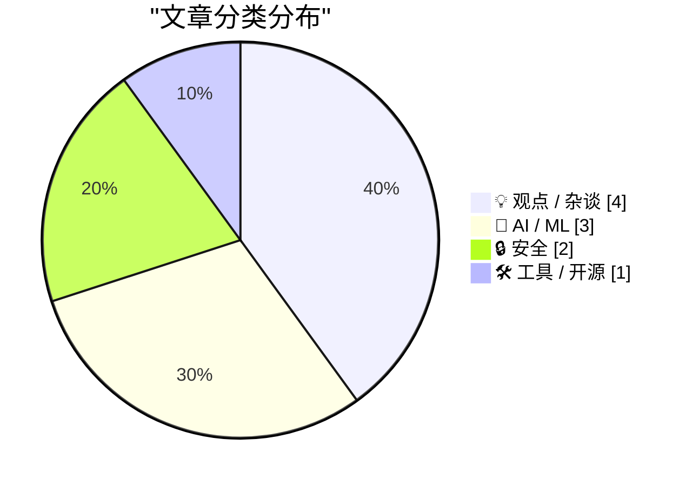
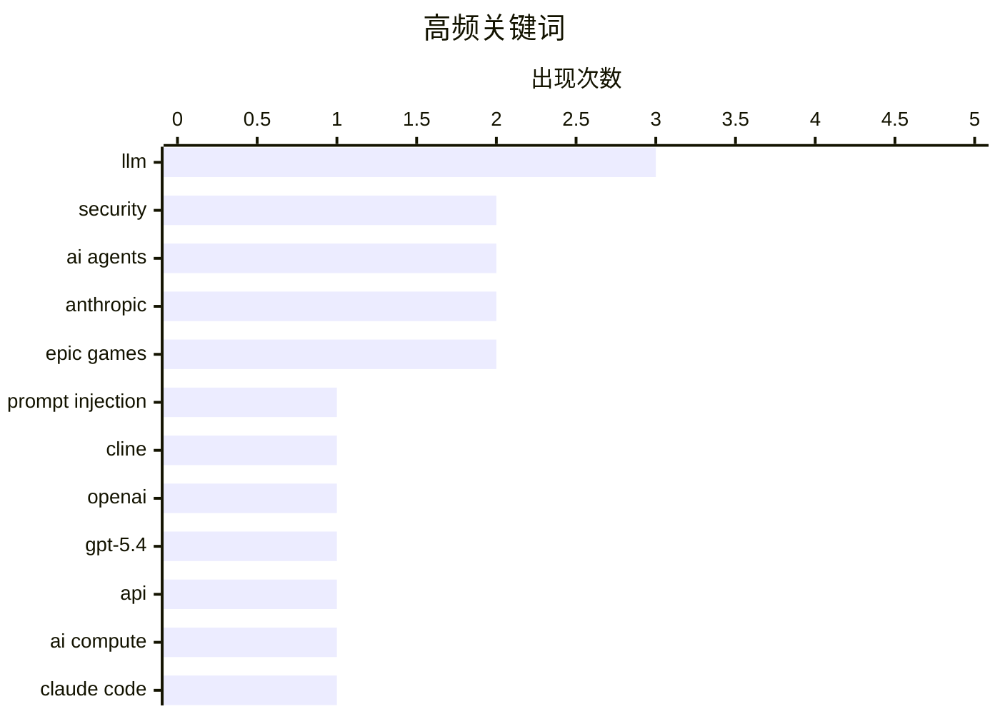

# 📰 AI 博客每日精选 — 2026-03-08

> 来自 Karpathy 推荐的 92 个顶级技术博客，AI 精选 Top 10

## 📝 今日看点

AI 领域迎来新一轮迭代爆发，OpenAI 发布 GPT-5.4 并通过开源支持计划加速生态扩张，推动编码代理向具备自主验证能力的工程模式演进。然而，算力瓶颈与针对 AI 工具的新型提示词注入攻击正成为行业隐忧，迫使开发者在追求效率的同时重新审视基础设施压力与安全防线。此外，随着 AI 模型趋于商品化，巨头间的竞争重心正从技术参数转向国防合同与移动生态的法律博弈，深刻引发了从业者对软件工程职业前景的重塑与反思。

---

## 🏆 今日必读

🥇 **Clinejection：仅通过 Issue 标题注入提示词即可攻破 Cline 的生产发布**

[Clinejection — Compromising Cline's Production Releases just by Prompting an Issue Triager](https://simonwillison.net/2026/Mar/6/clinejection/#atom-everything) — simonwillison.net · 1 天前 · 🔒 安全

> 揭示了针对 Cline 开源项目的严重攻击链，攻击者仅需在 GitHub Issue 标题中构造恶意提示词即可触发。该项目使用了 anthropics/claude-code-action@v1 自动化处理 Issue，而 Claude Code 代理拥有仓库的写权限。通过提示词注入，攻击者能诱导 AI 代理执行任意命令，甚至篡改生产代码或窃取密钥。这一案例凸显了赋予 AI 代理自主写权限的巨大安全风险，尤其是在处理未经审核的外部输入时。作者强调，在 AI 代理工作流中加入“人工审核”环节已刻不容缓。

💡 **为什么值得读**: 深度剖析了 AI 代理在 GitHub 工作流中的安全漏洞，是开发者构建 AI 自动化工具时必须引以为戒的实战案例。

🏷️ Prompt Injection, Cline, Security, AI Agents

　

🥈 **OpenAI 发布 GPT-5.4**

[Introducing GPT‑5.4](https://simonwillison.net/2026/Mar/5/introducing-gpt54/#atom-everything) — simonwillison.net · 1 天前 · 🤖 AI / ML

> OpenAI 正式推出了两款新型 API 模型：gpt-5.4 和 gpt-5.4-pro，并同步上线 ChatGPT 和 Codex CLI。新模型将知识截止日期更新至 2025 年 8 月 31 日，并提供高达 100 万 token 的超长上下文窗口。此次发布进一步优化了长文本处理能力，并调整了 API 定价策略以适配不同规模的开发需求。GPT-5.4 系列旨在通过更强的推理能力和更广的知识库，巩固其在生成式 AI 领域的领先地位。开发者现在可以通过 OpenAI 官方文档获取最新的模型调用指南。

💡 **为什么值得读**: 关注大模型最新进展的必读资讯，涵盖了模型参数更新、上下文窗口扩展及定价变化等核心信息。

🏷️ OpenAI, GPT-5.4, LLM, API

　

🥉 **AI 算力危机是否已经降临？**

[Is the AI Compute Crunch Here?](https://martinalderson.com/posts/is-the-ai-compute-crunch-here/?utm_source=rss&amp;utm_medium=rss&amp;utm_campaign=feed) — martinalderson.com · 23 小时前 · 🤖 AI / ML

> 探讨了 AI 编程工具普及带来的巨大算力压力，指出 Anthropic 的 Claude Code 用户数已达 200 万至 300 万。这一数字虽然仅占全球知识工作者的 1%，但其消耗的计算资源已让行业感到不安。随着 AI 代理从简单的对话转向复杂的代码执行和持续任务，算力需求呈指数级增长。作者通过数学推导指出，如果 AI 渗透率继续提升，当前的硬件基础设施和电力供应将面临严峻挑战。结论认为，算力瓶颈可能比我们预想中更早成为 AI 发展的制约因素。

💡 **为什么值得读**: 通过具体用户数据量化了 AI 代理对算力的巨大胃口，引发对行业可持续性和硬件瓶颈的深思。

🏷️ AI compute, Claude Code, LLM

　

---

## 📊 数据概览

| 扫描源 | 抓取文章 | 时间范围 | 精选 |
|:---:|:---:|:---:|:---:|
| 88/92 | 2499 篇 → 39 篇 | 48h | **10 篇** |

### 分类分布



### 高频关键词



<details>
<summary>📈 纯文本关键词图（终端友好）</summary>

```
llm              │ ████████████████████ 3
security         │ █████████████░░░░░░░ 2
ai agents        │ █████████████░░░░░░░ 2
anthropic        │ █████████████░░░░░░░ 2
epic games       │ █████████████░░░░░░░ 2
prompt injection │ ███████░░░░░░░░░░░░░ 1
cline            │ ███████░░░░░░░░░░░░░ 1
openai           │ ███████░░░░░░░░░░░░░ 1
gpt-5.4          │ ███████░░░░░░░░░░░░░ 1
api              │ ███████░░░░░░░░░░░░░ 1
```

</details>

### 🏷️ 话题标签

**llm**(3) · **security**(2) · **ai agents**(2) · anthropic(2) · epic games(2) · prompt injection(1) · cline(1) · openai(1) · gpt-5.4(1) · api(1) · ai compute(1) · claude code(1) · claude(1) · open source(1) · ai policy(1) · pentagon(1) · ethics(1) · ios(1) · exploit(1) · google gtig(1)

---

## 💡 观点 / 杂谈

### 1. **Anthropic 与美国国防部**

[Anthropic and the Pentagon](https://simonwillison.net/2026/Mar/6/anthropic-and-the-pentagon/#atom-everything) — **simonwillison.net** · 1 天前 · ⭐ 26/30

> 安全专家 Bruce Schneier 深入分析了 Anthropic、OpenAI 与美国国防部（五角大楼）之间近期签署的合同争议。文章指出，顶级 AI 模型正逐渐商品化，各家性能趋同，导致竞争焦点转向了系统集成、合规性及政府关系。作者探讨了 AI 技术在军事领域的应用边界，以及科技公司在国家安全需求与企业伦理承诺之间的艰难权衡。结论认为，这种合作标志着 AI 行业进入了由政府订单驱动的新阶段，模型本身的差异化将不再是核心竞争力。这篇评论被认为是目前对该话题最深刻且理性的解读。

🏷️ AI Policy, Anthropic, Pentagon, Ethics

　

### 2. **我不知道十年后我的工作是否还会存在**

[I don't know if my job will still exist in ten years](https://seangoedecke.com/will-my-job-still-exist/) — **seangoedecke.com** · 1 天前 · ⭐ 25/30

> 一位资深软件工程师反思了 AI 对职业前景的冲击，对比了 2021 年行业的繁荣与 2026 年的不确定性。作者认为，随着 AI 编码能力的飞跃，软件工程行业在未来十年内将发生翻天覆地的变化，甚至可能不复存在。传统的代码编写和系统维护模式正迅速被 AI 自动化取代，导致开发者对职业稳定性的信心大幅下降。文章表达了对技术演进速度的焦虑，并探讨了人类工程师在 AI 时代可能扮演的新角色。作者呼吁同行重新审视核心竞争力，以应对即将到来的行业重塑。

🏷️ Career, Software Engineering, AI Impact

　

### 3. **The Verge 专访 Tim Sweeney：赢得“Epic 诉谷歌案”后的反思**

[The Verge Interviews Tim Sweeney After Victory in ‘Epic v. Google’](https://www.theverge.com/23996474/epic-tim-sweeney-interview-win-google-antitrust-lawsuit-district-court) — **daringfireball.net** · 1 天前 · ⭐ 25/30

> Epic Games 首席执行官 Tim Sweeney 在赢得针对谷歌的反垄断诉讼后接受了专访，详细对比了苹果与谷歌的垄断策略。他将苹果形容为“冰”，其垄断手段主要依靠内部封闭的条款和强制性的支付系统；而将谷歌形容为“火”，指责其通过向开发者和运营商支付巨额费用来维持安卓生态的控制权。Sweeney 披露了谷歌如何通过秘密协议阻碍竞争，并分享了对未来移动应用市场开放性的乐观预期。这次采访揭示了 Epic 长期法律斗争背后的动机及其对公平竞争环境的定义。

🏷️ antitrust, Epic Games, Google, Apple

　

### 4. **Tim Sweeney 签署协议，2032 年前禁止批评谷歌 Play 商店**

[Tim Sweeney Signed Away His Right to Criticize Google’s Play Store Until 2032](https://www.theverge.com/news/889595/tim-sweeney-signed-away-his-right-to-criticize-google-until-2032) — **daringfireball.net** · 1 天前 · ⭐ 23/30

> 尽管在诉讼中取得了胜利，Tim Sweeney 却在与谷歌的最终和解协议中签署了严苛的禁言条款。根据 3 月 3 日签署的约束性条款，Sweeney 在 2032 年之前不得就谷歌的应用分发实践、费用或政策进行任何批评或公开倡议。这意味着他放弃了未来八年内游说改变谷歌商店政策的权利，也无法再就相关话题提起新的诉讼。这一反转引发了外界对和解代价的广泛讨论，认为谷歌成功通过法律协议“封口”了其最激进的批评者。文章指出，这可能是谷歌在反垄断压力下采取的一种高明的防御策略。

🏷️ Google Play, Epic Games, legal, settlement

　

## 🤖 AI / ML

### 5. **OpenAI 发布 GPT-5.4**

[Introducing GPT‑5.4](https://simonwillison.net/2026/Mar/5/introducing-gpt54/#atom-everything) — **simonwillison.net** · 1 天前 · ⭐ 27/30

> OpenAI 正式推出了两款新型 API 模型：gpt-5.4 和 gpt-5.4-pro，并同步上线 ChatGPT 和 Codex CLI。新模型将知识截止日期更新至 2025 年 8 月 31 日，并提供高达 100 万 token 的超长上下文窗口。此次发布进一步优化了长文本处理能力，并调整了 API 定价策略以适配不同规模的开发需求。GPT-5.4 系列旨在通过更强的推理能力和更广的知识库，巩固其在生成式 AI 领域的领先地位。开发者现在可以通过 OpenAI 官方文档获取最新的模型调用指南。

🏷️ OpenAI, GPT-5.4, LLM, API

　

### 6. **AI 算力危机是否已经降临？**

[Is the AI Compute Crunch Here?](https://martinalderson.com/posts/is-the-ai-compute-crunch-here/?utm_source=rss&amp;utm_medium=rss&amp;utm_campaign=feed) — **martinalderson.com** · 23 小时前 · ⭐ 27/30

> 探讨了 AI 编程工具普及带来的巨大算力压力，指出 Anthropic 的 Claude Code 用户数已达 200 万至 300 万。这一数字虽然仅占全球知识工作者的 1%，但其消耗的计算资源已让行业感到不安。随着 AI 代理从简单的对话转向复杂的代码执行和持续任务，算力需求呈指数级增长。作者通过数学推导指出，如果 AI 渗透率继续提升，当前的硬件基础设施和电力供应将面临严峻挑战。结论认为，算力瓶颈可能比我们预想中更早成为 AI 发展的制约因素。

🏷️ AI compute, Claude Code, LLM

　

### 7. **代理式手动测试**

[Agentic manual testing](https://simonwillison.net/guides/agentic-engineering-patterns/agentic-manual-testing/#atom-everything) — **simonwillison.net** · 1 天前 · ⭐ 25/30

> 探讨了“代理式工程模式”中的核心理念，即编码代理必须具备执行其所编写代码的能力。与仅生成代码片段的传统 LLM 不同，编码代理可以通过运行代码来验证其正确性，从而避免产生不可用的幻觉。文章强调，在未经过实际执行验证前，永远不要假设 LLM 生成的代码是有效的。通过这种“执行-反馈-修正”的闭环，AI 代理能够显著提升开发任务的成功率。作者认为，这种具备自我校验能力的代理模式将成为未来软件工程的标准配置。

🏷️ AI Agents, Software Testing, Agentic Engineering

　

## 🔒 安全

### 8. **Clinejection：仅通过 Issue 标题注入提示词即可攻破 Cline 的生产发布**

[Clinejection — Compromising Cline's Production Releases just by Prompting an Issue Triager](https://simonwillison.net/2026/Mar/6/clinejection/#atom-everything) — **simonwillison.net** · 1 天前 · ⭐ 28/30

> 揭示了针对 Cline 开源项目的严重攻击链，攻击者仅需在 GitHub Issue 标题中构造恶意提示词即可触发。该项目使用了 anthropics/claude-code-action@v1 自动化处理 Issue，而 Claude Code 代理拥有仓库的写权限。通过提示词注入，攻击者能诱导 AI 代理执行任意命令，甚至篡改生产代码或窃取密钥。这一案例凸显了赋予 AI 代理自主写权限的巨大安全风险，尤其是在处理未经审核的外部输入时。作者强调，在 AI 代理工作流中加入“人工审核”环节已刻不容缓。

🏷️ Prompt Injection, Cline, Security, AI Agents

　

### 9. **谷歌威胁情报团队揭秘 Coruna：来源神秘的强大 iOS 漏洞利用工具包**

[Google’s Threat Intelligence Group on Coruna, a Powerful iOS Exploit Kit of Mysterious Origin](https://cloud.google.com/blog/topics/threat-intelligence/coruna-powerful-ios-exploit-kit) — **daringfireball.net** · 1 天前 · ⭐ 26/30

> 谷歌威胁情报团队（GTIG）发现了一个名为“Coruna”的极具杀伤力的 iOS 漏洞利用工具包。该工具包针对 iOS 13.0 至 17.2.1 版本的 iPhone，包含了 5 条完整的漏洞利用链和总计 23 个独立漏洞。其核心价值在于对 iOS 漏洞的全面收集，能够实现从初始访问到持久化控制的完整攻击流程。目前该工具包的开发者身份尚不明确，但其技术复杂度显示出极高的专业水准。谷歌已将相关细节通报 Apple，并提醒用户及时更新系统以防范此类高级持续性威胁。

🏷️ iOS, exploit, security, Google GTIG

　

## 🛠 工具 / 开源

### 10. **Codex 推出开源项目支持计划**

[Codex for Open Source](https://simonwillison.net/2026/Mar/7/codex-for-open-source/#atom-everything) — **simonwillison.net** · 4 小时前 · ⭐ 26/30

> 继 Anthropic 为开源维护者提供免费 Claude Max 后，OpenAI 也推出了竞争性方案以争夺开发者生态。该计划为热门开源项目（需满足 5000+ Star 或 100 万+ NPM 月下载量）的维护者提供 6 个月的免费 ChatGPT Pro 订阅，价值每月 200 美元。参与者将获得 Codex 工具的使用权，以及对最新 GPT-5.4 模型的有条件访问权限。此举旨在通过免费提供顶尖 AI 生产力工具，吸引核心开发者留在 OpenAI 的生态体系内。这标志着 AI 巨头之间的竞争已从模型性能延伸到了对开发者社区的直接扶持。

🏷️ Anthropic, Claude, Open Source, LLM

　

*生成于 2026-03-08 07:02 | 扫描 88 源 → 获取 2499 篇 → 精选 10 篇*
*基于 [Hacker News Popularity Contest 2025](https://refactoringenglish.com/tools/hn-popularity/) RSS 源列表，由 [Andrej Karpathy](https://x.com/karpathy) 推荐*
*由「懂点儿AI」制作，欢迎关注同名微信公众号获取更多 AI 实用技巧 💡*

*明天7点见* 🪭
